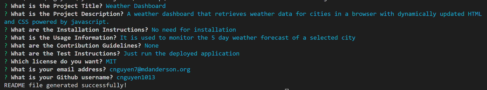

# 09-Professional-README-Generator

## Description

A command-line application that dynamically generates a professional README.md file from a user's input using the Inquirer package.

## Main Site

## Location of Repository

The source code is found in the index.js file, relevant js code can be found within utils/. All relevant images will be contained in the assets/images folder. A sample README.md generated from the application can be found as "README_deploy.md".

## Link to Depolyed Application

N/A

## Link to demo video

The demo video can be found here: https://drive.google.com/file/d/1qBbHPbk74ZXMKPtd0k95lBVkvGNZhXIi/view?usp=sharing